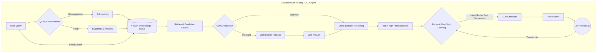

# DocuMind: Self-Healing RAG Engine

A highly advanced, self-correcting Retrieval-Augmented Generation (RAG) system built with FastAPI, LangChain, FAISS, and LlamaIndex. DocuMind focuses on delivering precise, relevant answers from local documents through a multi-stage validation and retrieval process.

## Architecture

DocuMind uses a robust pipeline to ensure high accuracy and resilience:



1. **Query Enhancement**: Applies Hypothetical Document Embeddings (HyDE) and Query Decomposition to break down complex questions into optimal vector search vectors.
2. **FAISS Retrieval**: High-speed, local vector search using `BAAI/bge-small-en-v1.5` embeddings to retrieve candidate chunks.
3. **CRAG (Corrective RAG)**: Self-healing validation mechanism. A grader model verifies candidate relevance. If results are poor, it triggers query rewriting or web search fallbacks.
4. **Cross-Encoder Reranking**: Re-ranks the filtered candidates for maximum semantic precision.
5. **Dynamic Few-Shot Learning**: A background learning manager that stores highly-rated user interactions (via thumbs-up feedback) to be injected as dynamic few-shot context in future generation tasks.
6. **LLM Generation**: Generates the final output using the validated, optimized context.

## Requirements

- Python 3.9+
- NVIDIA API Key (`NVIDIA_API_KEY`)
- Tavily API Key (`TAVILY_API_KEY`) for web-search fallback

Dependencies are listed in `requirements.txt`. 

## Setup

1. **Clone the repository** (backend engine only).
2. **Create a virtual environment**:
   ```bash
   python -m venv venv
   source venv/bin/activate  # On Windows: venv\Scripts\activate
   ```
3. **Install Dependencies**:
   ```bash
   pip install -r requirements.txt
   ```
4. **Environment Setup**:
   Create a `.env` file in the root directory:
   ```env
   NVIDIA_API_KEY=your_nvidia_api_key
   TAVILY_API_KEY=your_tavily_api_key
   ```
5. **Run the API Server**:
   ```bash
   cd backend
   uvicorn api_server:app --reload
   ```

## API Endpoints

- `POST /api/upload-file`: Upload PDF files to be parsed, chunked, and indexed.
- `POST /api/query`: Send a question to the RAG pipeline. Configuration parameters (HyDE, CRAG, Reranking) can be dynamically toggled.
- `POST /api/feedback`: Submit user feedback (thumbs up/down) to train the Dynamic Learning Manager.

## License

MIT License.
